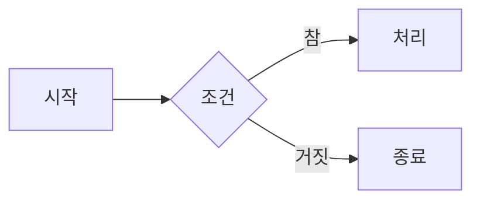

# 마크다운 정리

## 목차
1. 개념
2. 기술
    - 제목 다루기
    - 문단과 줄바꿈
    - 강조
    - 목록
    - 코드
    - 인용문과 수평선
    - 링크와 이미지
    - 표
    - 확장 문법
        - 작업 목록
        - 취소선
        - 각주
        - 알림 상자
        - 다이어그램

---
## 개념

마크다운(Markdown)은 일반 텍스트에 몇 가지 기호를 섞어 문서의 구조를 표현하는 표기 방식

마크다운 파일의 확장자는 `.md`입니다.

---
## 기술

### 제목 다루기

줄 앞에 `#`을 놓고 `공백`을 하나 넣은 뒤 제목을 씁니다.

```markdown
# 1단계
## 2단계
### 3단계
#### 4단계
##### 5단계
###### 6단계
```

`#`의 개수에 따라 제목의 단계가 결정됩니다.

**<mark>주의사항</mark>**

`#` 뒤의 `공백`은 생략할 수 없습니다.

| 입력 | 결과 |
|---|---|
| `# 제목` | 제목으로 인식됩니다 |
| `#제목` | #제목 이 표시됩니다 |

제목은 단계를 건너뛰지 않고 순서대로 쓰는 것이 좋습니다.

<좋은 예시>

```markdown
# 게임명
## 설치
### 사전 준비
### 설치 절차
## 실행법
```

1단계 제목은 문서당 하나만 두는 것이 일반적입니다.

---
### 문단과 줄바꿈

GitHub 기준 줄을 그냥 바꾸면 줄이 바뀌지 않습니다.

빈 줄을 문단의 경계로 사용합니다.

#### 1) 문단 구분

빈 줄을 하나 넣습니다.

```markdown
첫 번째 문단입니다.

두 번째 문단입니다.
```

#### 2) 문단 내에서 줄바꿈

줄 끝에 `공백 2개`, `\`, `<br>`을 사용할 수 있습니다.

```markdown
줄 끝에 공백 두 개를 넣습니다.·· -> 공백표시
이 줄은 바로 아래에 붙습니다.

줄 끝에 백슬래시를 넣습니다.\
이 줄도 바로 아래에 붙습니다.

HTML 태그를 씁니다.<br>
이 줄도 바로 아래에 붙습니다.
```

| 방법 | 표기 | 특징 |
|---|---|---|
| 공백 두 개 | 줄 끝에 공백 2칸 | 눈에 보이지 않습니다 |
| 백슬래시 | 줄 끝에 `\` | 눈에 보여 실수를 줄일 수 있습니다 |
| HTML | `<br>` | HTML을 허용하는 곳에서 사용합니다 |

#### 3) 정리

| 입력 | 결과 |
|---|---|
| 엔터 한 번 | 줄이 이어집니다 |
| 빈 줄 | 새 문단이 시작됩니다 |
| 공백 2개 또는 `\` | 같은 문단에서 줄만 바뀝니다 |

---
### 강조

강조는 별표`*` 또는 밑줄`_`로 감싸는 방식을 씁니다.

하나로 감싸면 기울임, 두 개로 감싸면 굵게 표시됩니다.

```markdown
*기울임* 또는 _기울임_

**굵게** 또는 __굵게__

***굵은 기울임*** 또는 ___굵은 기울임___
```

<적용 결과>

*기울임*

**굵게**

***굵은 기울임***

#### 1) 별표와 밑줄의 차이

둘 다 같은 결과를 내지만 단어 중간에서는 동작이 다릅니다.

```markdown
Game*Object*
Game_Object_
```

#### 2) 기호를 글자 그대로 쓰기

문법으로 사용되는 기호를 문자 그대로 보이려면 앞에 `\`를 붙입니다.

```markdown
\*별표\*
\_밑줄\_
```

이것을 **이스케이프**라고 합니다.

---
### 목록

목록은 여러 항목을 나열할 때 사용합니다.

- 순서 없는 목록 : 순서가 중요하지 않은 내용
- 순서 있는 목록 : 순서가 중요한 내용

#### 1) 순서 없는 목록

줄 앞에 `-`, `+`, `*` 중 하나를 놓고 공백을 넣습니다.

```markdown
- 첫째 항목
- 둘째 항목
- 셋째 항목
```

한 문서에서는 기호를 하나로 통일하는 것이 좋습니다.

#### 2) 순서 있는 목록

숫자와 마침표를 사용합니다.

```markdown
1. 저장소를 내려받습니다.
2. 프로젝트를 엽니다.
3. 실행합니다.
```

#### 3) 중첩 목록

목록 안에 목록을 넣으려면 들여쓰기를 합니다.

```markdown
- 상위 항목
  - 하위 항목
  - 하위 항목
- 상위 항목
```

---
### 코드

코드를 일반 문장과 구분하기 위해 사용합니다.

#### 1) 인라인 코드

백틱(`)으로 감쌉니다.

```markdown
`config.json` 파일을 확인합니다.
```

#### 2) 코드 블록

백틱 3개로 감쌉니다.

````markdown
```csharp
using UnityEngine;

public class Player : MonoBehaviour
{
}
```
````

#### 3) 언어 지정

여는 백틱 뒤에 언어 이름을 적으면 문법 강조가 적용됩니다.

```markdown
```csharp 코드
```

```csharp
using UnityEngine;

public class Player : MonoBehaviour
{
    [SerializeField] private float _moveSpeed = 5f;

    private void Update()
    {
        float horizontal = Input.GetAxis("Horizontal");
        transform.Translate(Vector3.right * horizontal * _moveSpeed * Time.deltaTime);
    }
}
```
```
```bash
명령어
```
```bash
ls
cd
dir
```

| 언어 | 지정자 |
|---|---|
| C# | `csharp` |
| JSON | `json` |
| Markdown | `markdown` |
| 명령어 | `bash` |

---
### 인용문과 수평선

#### 1) 인용문

줄 앞에 `>`를 놓고 공백을 넣습니다.

```markdown
> 인용문입니다.
```

여러 줄을 인용하려면 각 줄 앞에 `>`를 붙입니다.

```markdown
> 첫 번째 줄입니다.
> 두 번째 줄입니다.
```

#### 2) 수평선

`-`, `*`, `_` 중 하나를 3개 이상 이어서 씁니다.

```markdown
---
```

---
### 링크와 이미지

#### 1) 링크

대괄호에 표시할 글자를 넣고 소괄호에 주소를 넣습니다.

```markdown
[Unity 공식 문서](https://docs.unity3d.com/)
```

#### 2) 문서 내 이동

```markdown
[설치 절차로 이동](#설치-절차)
```

#### 3) 상대 경로

```markdown
[설계 문서](docs/design.md)
```

#### 4) 이미지

링크 문법 앞에 `!`을 붙입니다.

```markdown

```


| 요소 | 역할 |
|---|---|
| `!` | 이미지임을 표시 |
| `[대체 텍스트]` | 이미지 설명 |
| `(경로)` | 이미지 위치 |

---
### 표

표는 여러 항목을 행과 열로 정리할 때 사용합니다.

**<mark>표는 GitHub 확장 문법입니다.</mark>**

#### 1) 기본 표

파이프(`|`)로 칸을 나누고, 두 번째 줄에 구분행을 넣습니다.

```markdown
| 컴포넌트 | 역할 |
|---|---|
| Transform | 위치·회전·크기 |
| Rigidbody | 물리 연산 |
| Collider | 충돌 판정 |
```

**<mark>구분행은 생략할 수 없습니다.</mark>**

#### 2) 정렬

구분행의 `:`을 이용합니다.

```markdown
| 왼쪽 | 가운데 | 오른쪽 |
|:---|:---:|---:|
| 1 | 2 | 3 |
```

| 표기 | 정렬 |
|---|---|
| `---` | 기본값 |
| `:---` | 왼쪽 |
| `:---:` | 가운데 |
| `---:` | 오른쪽 |

---
### 확장 문법

표준 마크다운에는 없지만 GitHub 등에서 추가로 지원하는 문법입니다.

**<mark>사용하는 환경에 따라 지원 여부가 다릅니다.</mark>**

#### 1) 작업 목록

```markdown
- [x] 플레이어 이동 구현
- [x] 장애물 생성
- [ ] 점수 표시
```

| 표기 | 결과 |
|---|---|
| `- [ ] 항목` | 빈 체크 상자 |
| `- [x] 항목` | 체크된 상자 |

#### 2) 취소선

물결표 2개로 감쌉니다.

```markdown
~~취소된 내용~~
```

<적용 결과>

~~취소된 내용~~

#### 3) 각주

본문에 표시를 남기고 아래쪽에 내용을 적습니다.

```markdown
Unity는 C#을 사용합니다[^1].

[^1]: Unity에서 사용하는 대표적인 스크립팅 언어입니다.
```

#### 4) 알림 상자

인용문 첫 줄에 정해진 표시를 넣습니다.

```markdown
> [!NOTE]
> 참고할 내용입니다.

> [!WARNING]
> 주의가 필요한 내용입니다.
```

| 표시 | 용도 |
|---|---|
| `[!NOTE]` | 참고할 내용 |
| `[!TIP]` | 도움이 되는 요령 |
| `[!IMPORTANT]` | 중요한 내용 |
| `[!WARNING]` | 주의가 필요한 내용 |
| `[!CAUTION]` | 위험을 알리는 내용 |

#### 5) 다이어그램

코드 블록의 언어 자리에 `mermaid`를 적으면 다이어그램으로 표시할 수 있습니다.

````markdown

````

<적용 결과>


---
